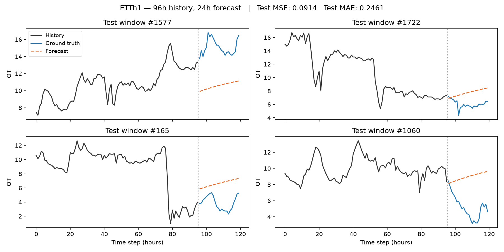

# Transformer baseline for long-sequence time-series forecasting on ETTh1

A minimal PyTorch implementation of a vanilla encoder–decoder Transformer for
long-sequence time-series forecasting, trained on the **ETTh1** dataset
(oil temperature, hourly), using the **Informer-style generative decoder input**
from Zhou et al., *"Informer: Beyond Efficient Transformer for Long Sequence
Time-Series Forecasting"*, AAAI 2021 ([arXiv:2012.07436](https://arxiv.org/abs/2012.07436)).



## What this project is

- A vanilla `nn.Transformer` (2 encoder layers, 1 decoder layer, `d_model=128`,
  4 heads) trained end-to-end on univariate ETTh1 (target: `OT`).
- Input length **96 h**, forecast horizon **24 h**.
- The decoder input follows the **generative-style construction** from the
  Informer paper (Eq. 6): the last 48 known values are used as the start token
  and concatenated with 24 zero placeholders, so the full 24-step forecast is
  produced in **one forward pass** instead of autoregressively.

## What this project is *not*

To be explicit, this is a **baseline**, not a reproduction of the Informer
architecture. The two headline contributions of the paper are **not**
implemented here:

- **ProbSparse self-attention** (`O(L log L)` attention). This code uses the
  standard `nn.MultiheadAttention` inside `nn.Transformer`.
- **Self-attention distilling** (Conv1d + MaxPool between encoder layers to
  halve the sequence length). Not implemented.

Only the *generative decoder input* trick from Informer is borrowed, applied
on top of a vanilla Transformer.

## Repository structure

```
.
├── data/
│   └── ETTh1.csv          # downloaded from the ETDataset repo, see below
├── train.py               # data loading, model, training loop, evaluation, plot
├── requirements.txt
├── forecast_example.png   # generated by train.py
└── README.md
```

## Setup

```bash
git clone https://github.com/<luigilanni>/transformer-lstf-etth1.git
cd transformer-lstf-etth1
pip install -r requirements.txt
```

Download `ETTh1.csv` from the official
[ETDataset repository](https://github.com/zhouhaoyi/ETDataset) and place it
next to `train.py` (or under `data/` and adjust the path).

## Run

```bash
python train.py
```

This will:

1. Split the series 70 / 15 / 15 (train / val / test) chronologically.
2. Standardize using **training statistics only**.
3. Train for up to 8 epochs with **early stopping** (patience 3) on
   validation MSE.
4. Save the best weights to `transformer_model.pth`.
5. Report **MSE** and **MAE** on the test set.
6. Save `forecast_example.png` showing four random test windows
   (history + forecast vs. ground truth), with test-set metrics in the title.

## Results

On the test set of ETTh1 (univariate, horizon 24) this baseline reaches:

| Metric | This baseline | Informer&dagger; (paper, Table 1) | Informer (paper, Table 1) |
|---|---|---|---|
| MSE | 0.091 | 0.092 | 0.098 |
| MAE | 0.246 | 0.246 | 0.247 |

The numbers land in the same range as **Informer&dagger;**, which is the paper's
own ablation using canonical self-attention with the Informer decoder — i.e.
the closest analogue to what is implemented here. This is a sanity check that
the training pipeline is set up correctly, **not** evidence that the model is
strong. Visually, the forecasts in `forecast_example.png` often flatten into a
mild trend and miss sharp turns in the ground truth. The full Informer, with
ProbSparse attention and distilling, is the one designed to actually push
prediction capacity on long horizons.

## Reference

- Zhou, Zhang, Peng, Zhang, Li, Xiong, Zhang.
  *Informer: Beyond Efficient Transformer for Long Sequence Time-Series
  Forecasting.* AAAI 2021.
  [arXiv:2012.07436](https://arxiv.org/abs/2012.07436).
- Vaswani et al. *Attention Is All You Need.* NeurIPS 2017.

## License

MIT.
